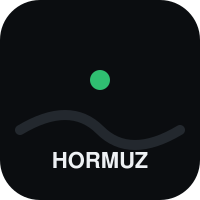
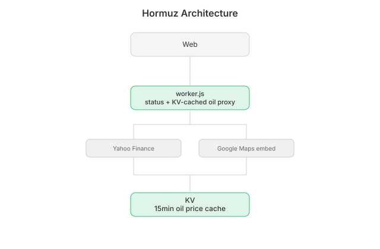

# Hormuz

  [](https://github.com/nulljosh/hormuz)

For forty years, a headline said Iran might close the Strait of Hormuz. Oil spiked. Nobody checked whether a ship had been stopped. Then in February 2026 it actually closed.

Hormuz checks. Live map of the strait, live WTI crude price with a daily/monthly/yearly chart, a long/short momentum read, and the actual answer, computed from real ship counts.

**[hormuz.heyitsmejosh.com →](https://hormuz.heyitsmejosh.com)**


## Features

- **Live map.** The strait itself, Google Maps embed.
- **Open or closed.** Computed from IMF PortWatch daily transits, not the headline.
- **Oil price.** WTI crude, daily/monthly/yearly, drawn live.
- **Long or short.** A momentum read off the chart you're looking at.
- **The reasoning.** A scroll-down explainer that gets denser the further you read, like an eye chart.

## Platforms

| | |
|---|---|
| Web | This repo, deployed to Cloudflare Workers |

## API

```
GET /api/status          → { open, last_closure, note }
GET /api/oil?range=5d    → { price, prevClose, timestamps, closes }
```

`range` is `5d`, `1mo`, or `1y`.

## Running locally

```bash
npx wrangler dev
```

## Deploying

```bash
npx wrangler deploy
```

## Architecture


